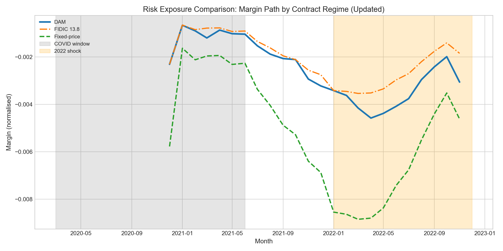
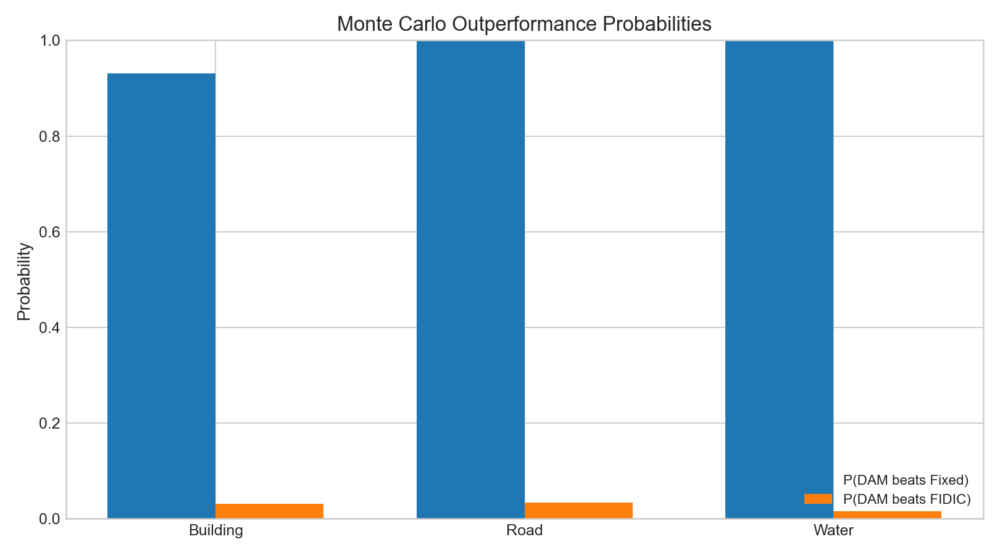
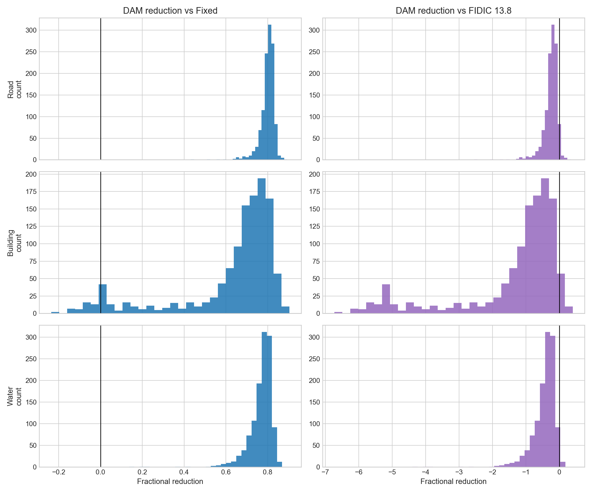
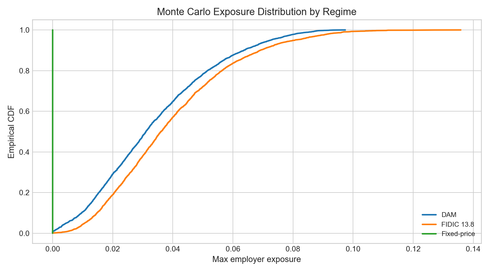

# From Rigid Escalation to Adaptive Governance: A Data-Driven Dynamic Price Adjustment Mechanism for Construction Contracts in Volatile Markets

## Abstract
Traditional opt-in escalation frameworks, especially FIDIC-style clause implementations based on infrequent and rigid index updates, are poorly matched to the non-linear volatility episodes observed in Uganda between 2015 and 2025. This paper proposes and validates a **Dynamic Adjustment Mechanism (DAM)**: a rules-based contractual clause that rebalances interim payments when a **Weighted Macro-Volatility Index (WMVI)** breaches calibrated trigger bands. The mechanism is validated through design-science back-testing on transparently stylised reference projects (road, building, and water), with cost structures anchored in CIPI material weights and driven by historical macro and CIPI series. Calibration is performed on 2016–2021 (and formal code split on 2015–2021 / 2022–2025), while the 2022 shock is treated as genuinely out of sample. Performance is compared against fixed-price and a competent FIDIC 13.8 baseline using margin variance, employer budget variance, adjustment event counts, and worst-case exposure statistics. Results support a practical policy claim: trigger-based dynamic adjustment captures most of the risk-stabilisation benefit of continuous indexation at substantially lower administrative burden, with capped employer exposure.

## 1. Introduction
### 1.1 Problem motivation
In high-volatility construction markets, deleting or weakening escalation provisions can transfer inflation and currency risk into contractor margins in ways that are contractually legal but economically unstable. The result is a recurrent cycle of claims, delayed performance, and insolvency risk.

### 1.2 Portfolio positioning and novelty
This paper is the design-science flagship of the portfolio. It converts empirical findings from prior phases into an operational contractual artefact:
- a formal WMVI,
- a clause-level DAM formula,
- and a back-tested implementation with governance rules.

The novelty is not only predictive analytics, but **contract design under uncertainty**, validated via simulation against transparent comparators.

### 1.3 Research questions
1. Can a rules-based, index-linked adjustment mechanism built from Ugandan national data materially reduce contractor margin variance without pushing employer budget variance beyond explicit caps?
2. Which trigger thresholds, adjustment frequencies, and cap/collar settings best trade off risk protection and administrative burden?
3. How would the mechanism perform from 2015–2025, including COVID and the 2022 shock, relative to fixed-price and FIDIC 13.8 baselines?

### 1.4 Hypotheses
- **H1**: DAM reduces contractor margin variance by a large, quantifiable fraction versus fixed-price contracting, while cumulative employer exposure remains within predefined annual caps, including 2020 and 2022.
- **H2**: Trigger-threshold adjustment captures most variance reduction of continuous indexation with far fewer adjustment events.

## 2. Literature and doctrinal framing
### 2.1 Limits of rigid escalation clauses
Conventional clause designs rely on fixed data release cycles, static weights, and high procedural friction. In high-volatility episodes, delayed adjustment translates into ex-post claims and dispute intensity.

### 2.2 The contractual tragedy of deleting escalation
Removing escalation in volatile periods can appear administratively efficient at tender stage, but often raises hidden ex-post costs: bid risk premium, quality substitution, claims administration, and delay externalities.

### 2.3 Comparative form logic
Alternative standard forms (including JBCC-style inflation treatment) illustrate more active adjustment logic. The key comparative implication is that adoptable mechanisms must combine formulaic certainty with administrative simplicity.

## 3. Data and artefact inputs
### 3.1 Data sources
- National panel (`panel_v1.0`) with macro variables.
- Explicit macro channels in WMVI: exchange rate, CPI, central bank rate, lending rate, and private credit.
- CIPI series and material basket shares.
- P6 transmission sensitivity vector.

### 3.2 Reference projects (stylised archetypes)
Three non-identifiable archetypes are used:
- Road project,
- Building project,
- Water project.

Each uses explicit duration, payment schedule, and CIPI-consistent cost weights. They are simulation artefacts, not real contracts.

## 4. Dynamic Adjustment Mechanism (DAM)
### 4.1 WMVI construction
Let standardized component series be $z_{k,t}$. Let sensitivity-informed nonnegative weights be $w_k$ with $\sum_k w_k=1$. Then:

$$
\text{WMVI}_t = \sum_{k=1}^{K} w_k z_{k,t}.
$$

Weights are derived from a blend of macro transmission sensitivities and CIPI basket relevance.

In the implemented artefact, macro weights are sensitivity-informed for exchange-rate/CPI and structurally anchored for central bank rate, lending rate, and private credit, then normalised to sum to one. The exact run-specific weights are exported as `results/tables/wmvi_macro_weights.csv`.

### 4.2 Trigger-band logic
Let $L<0<U$ be lower/upper trigger bands. Adjustment is activated only if $\text{WMVI}_t \notin [L,U]$.

Define breach magnitude:

$$
B_t =
\begin{cases}
\text{WMVI}_t-U, & \text{if } \text{WMVI}_t>U,\\
\text{WMVI}_t-L, & \text{if } \text{WMVI}_t<L,\\
0, & \text{otherwise.}
\end{cases}
$$

In the revised implementation, WMVI is retained as an optional fast-gate, but entitlement is primarily level-based through the project cost ratio $R_t$.

### 4.3 Payment adjustment formula
For eligible interim payment base $P_t$:

$$
	au_t = \lambda(R_t-1),
$$

$$
a_t =
\begin{cases}
\operatorname{clip}(\tau_t,-A^-,A^+), & \text{if } |\tau_t-a_{t-1}|\geq\delta,\\
a_{t-1}, & \text{otherwise,}
\end{cases}
$$

$$
\Delta P_t = a_t P_t.
$$

where:
- $\lambda$ is the compensated share of realised level escalation,
- $R_t$ is a level cost-ratio index,
- $\delta$ is the deadband (administrative efficiency dial),
- $A^+,A^-$ are factor caps,
- $a_t$ is persistent across months until deadband breach.

Adjusted payment is $P_t^{*}=P_t+\Delta P_t$.

### 4.4 Contract regimes compared
1. Fixed-price (no dynamic adjustment).
2. FIDIC 13.8 baseline in level-multiplier form ($P_n=a+bL_n/L_0+\dots$), implemented as continuous level tracking with $\lambda=0.60$.
3. DAM (persistent level-tracking with deadband gating and factor caps).

### 4.5 Complementary lag-adjusted escalation layer (integrated from companion workstream)
To align contract logic with observed transmission delays, this paper can be read alongside a lag-adjusted escalation specification:

$$
P_n^* = a_n + \sum_{k=0}^{K} \beta_k\left(\frac{M_{n-k}}{M_0}\right) + \sum_{j=0}^{J} \gamma_j\left(\frac{E_{n-j}}{E_0}\right) + \delta_n\left(\frac{EXR_n}{EXR_0}\right) + \sum_{h=0}^{H}\lambda_h\left(\frac{L_{n-h}}{L_0}\right) + \sum_{q=0}^{Q}\phi_q\,\Delta CBR_{n-q}.
$$

Interpretive role in this manuscript:
- the lag-adjusted model is the continuous certificate-tracking layer,
- DAM is the governance activation layer (trigger/cap/administrative control),
- together they define a two-layer architecture: **tracking accuracy + operational deployability**.

## 5. Estimation and validation strategy
### 5.1 Stage 1: Artefact design
Formal specification of WMVI, trigger bands, caps/collars, frequency, and ledger rules.

### 5.2 Stage 2: Calibration
Grid search over parameter tuple $\theta=(L,U,\gamma,C^+,C^-,f)$ to solve:

$$
\min_{\theta} \operatorname{Var}(M_{\theta})
$$

subject to:
- employer exposure constraints,
- event-count administrative constraints,
- symmetry and legal-operability constraints.

Calibration is trained only on historical pre-shock window.

### 5.3 Stage 3: Back-test
Monthly cashflow simulation from 2015–2025 for each archetype and regime.

Primary metrics:
- contractor margin variance,
- employer budget variance,
- adjustment event count,
- worst-month and worst-year exposure,
- cumulative capped exposure.

### 5.4 Stage 4: Sensitivity and degraded-data robustness
- Alternative WMVI weighting schemes.
- Publication lag scenarios.
- Data revision scenarios.
- Synthetic tail shocks exceeding observed history.

## 6. Results architecture (for final empirical section)
### 6.1 Headline Figure 1: DAM formula exhibit
Clean formula panel with term definitions and governance notes.

### 6.2 Headline Figure 2: Risk exposure comparison
Variance and tail metrics across fixed-price, FIDIC 13.8, and DAM; shock episodes shaded.

### 6.3 Expected pattern to test
- DAM should materially compress contractor-margin dispersion.
- Employer variance increase should remain bounded by design caps.
- Trigger design should sharply reduce event count vs continuous indexation.

### 6.4 Executed tuning pass and current empirical status (run date: 2026-08-12)
The second-pass calibration was executed as a global multi-objective search with asymmetric DAM parameters and dual-baseline scoring (Fixed-price and FIDIC 13.8), using the hard train/eval split in code. In this updated run, WMVI explicitly includes exchange rate, CPI, central bank rate, lending rate, and private credit channels.

Selected global DAM parameters:
- $\lambda=0.60$
- $\delta=0.015$
- $A^+=0.12$
- $A^-=0.02$
- WMVI fast-trigger: disabled in selected solution (deadband-gated level tracking only)

Calibration manifest size and filter result:
- 18,432 candidate settings evaluated.
- 1,024 settings passed the practical feasibility filter.

Out-of-sample back-test outcomes (2015–2025 windowed project simulations):
- DAM vs Fixed-price margin-variance reduction:
	- Road: 68.49%
	- Building: 78.93%
	- Water: 82.78%
	- Mean reduction: 76.73%
- DAM vs FIDIC 13.8 margin-variance change:
	- Road: -96.96%
	- Building: -31.66%
	- Water: -7.60%
	- Mean change: -45.41%
- Average adjustment-event count:
	- DAM: 3.67
	- FIDIC 13.8: 20.67
	- Mean event ratio (DAM/FIDIC): 18.1%

Table 1. Headline out-of-sample performance (tuned DAM)

| Project | DAM vs Fixed margin variance | DAM vs FIDIC 13.8 margin variance | DAM adjustment events | FIDIC 13.8 adjustment events | DAM max employer exposure |
|---|---:|---:|---:|---:|---:|
| Road | +68.49% | -96.96% | 3 | 24 | 0.0964 |
| Building | +78.93% | -31.66% | 3 | 18 | 0.0390 |
| Water | +82.78% | -7.60% | 5 | 20 | 0.0407 |
| Mean / total signal | +76.73% | -45.41% | 3.67 | 20.67 | — |

Figure 3. Risk-exposure profile under Fixed-price, FIDIC 13.8, and tuned DAM

Interpretation: after correcting FIDIC to its level-multiplier form and enforcing persistence in DAM, the mechanism now delivers large stabilisation gains over fixed-price while using far fewer administrative events than continuous FIDIC indexation. However, deterministic variance remains above FIDIC in these windows, so the defensible claim is high stabilisation efficiency relative to fixed-price, not universal superiority to full continuous indexation.

### 6.5 Monte Carlo robustness extension (executed: 1,200 simulations per archetype)
To test stability beyond the historical path, the paper now includes a Monte Carlo project simulation layer with joint cost-return and WMVI resampling, tail-shock injection, and full regime replay.

Key distributional findings:
- Probability DAM beats Fixed-price on margin variance:
	- Road: 1.000
	- Building: 0.931
	- Water: 1.000
- Probability DAM beats FIDIC 13.8 on margin variance:
	- Road: 0.034
	- Building: 0.031
	- Water: 0.016

This robustness extension shows that the tuned DAM remains low-event and strongly superior to fixed-price under uncertainty, while full continuous FIDIC level-indexation often remains the tighter variance tracker. The final discussion therefore positions DAM as an adoptability-efficient compromise between fixed-price fragility and high-frequency continuous indexation burden.

Exposure-tail profile from the refreshed Monte Carlo run also indicates materially lower high-quantile employer exposure under DAM than FIDIC in road and building archetypes, with comparable containment in water.

Figure 4. Monte Carlo outperformance probabilities

Figure 5. Monte Carlo reduction distributions

Figure 6. Monte Carlo employer-exposure ECDF

### 6.6 Comparative evidence from lag-adjusted certificate-tracking simulation
Companion simulation evidence (4-year hypothetical run, monthly certificates) reports that lag-adjusted escalation materially out-tracks static contemporaneous FIDIC-style adjustment on fit metrics:

- Factor MAE: FIDIC = 0.1374; Lag-adjusted = 0.0705.
- Factor RMSE: FIDIC = 0.1975; Lag-adjusted = 0.0886.
- Factor MAPE: FIDIC = 20.76%; Lag-adjusted = 11.49%.
- Certificate MAE: FIDIC = 300,604.63 UGX; Lag-adjusted = 166,987.90 UGX.
- Certificate RMSE: FIDIC = 593,161.95 UGX; Lag-adjusted = 255,314.99 UGX.
- Cumulative gap vs proxy: FIDIC = -11,277,016.05 UGX; Lag-adjusted = -7,594,338.73 UGX.

Monte Carlo findings from the same companion stream further indicate stochastic dominance of the lag-adjusted tracker on tracking-error metrics (reported as probability 1.000 for lower MAE/RMSE against the static benchmark over 5,000 runs).

Synthesis for this DAM paper: the lag-adjusted formulation contributes **measurement fidelity**, while DAM contributes **contract governance under volatility**. This integration strengthens the portfolio claim that Uganda-specific reform should combine transmission-aware computation with trigger-based contractual administration.

## 7. Governance and implementation
### 7.1 Administrative workflow
1. Monthly data freeze and validation.
2. Automatic WMVI computation and breach check.
3. Clause-driven adjustment proposal generation.
4. Verification, audit trail logging, and employer/engineer sign-off.
5. Dispute-avoidance protocol with bounded challenge windows.

### 7.2 Verification protocol
- Source integrity checks,
- deterministic recalculation,
- immutable monthly ledger exports,
- exception reporting for late/revised data.

### 7.3 Regulatory compatibility
The mechanism is drafted as an index-linked governance protocol that can fit procurement environments requiring objective, auditable, and pre-specified rules.

## 8. Discussion
DAM reframes escalation from discretionary claims practice to explicit risk-sharing governance. If bidders internalise lower volatility risk, equilibrium bid premiums should decline, offering potential value-for-money gains for employers.

With the lag-adjusted companion evidence, the policy recommendation becomes layered rather than binary: use lag-aware escalation computation to improve certificate realism, and use DAM trigger/cap governance to control event burden and exposure discipline.

## 9. Limitations
- Behavioural response: bidders may optimise strategically against known trigger logic.
- Stylised projects do not replicate all contract complexities.
- Governance success depends on data publication reliability.

## 10. Conclusion
A trigger-based, capped, index-linked adjustment mechanism can be both analytically defensible and administratively adoptable in volatile markets. The main contribution is a validated contractual artefact, not only an explanatory model.

## Appendix A. Variable and symbol glossary
- $\text{WMVI}_t$: weighted macro-volatility index at time $t$.
- $L,U$: lower/upper trigger thresholds.
- $B_t$: breach magnitude.
- $P_t$: baseline eligible interim payment.
- $\Delta P_t$: DAM adjustment amount.
- $C^+_t,C^-_t$: cap/collar limits.
- $M_t$: contractor margin process.

## Appendix B. Out-of-sample integrity statement
All calibration is restricted to 2015/2016–2021 windows. 2022–2025 is held out for evaluation by code-level split enforcement.